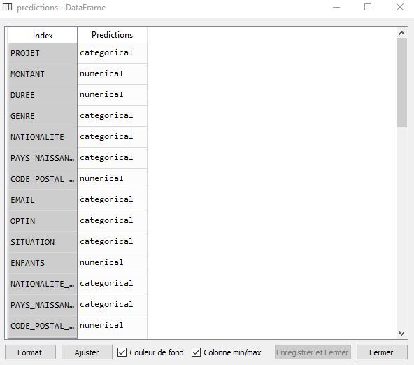

# Predicting whether a distribution is categorical or numerical


## Do you want to give it a try?

- You can get the library with ```pip install DataTypeIdentifier```

- Import a dataset

- Call the method "predict" on the dataset and you will have your predictions 

## Coding example:

```python
from pandas import read_csv
from os.path import join
from DataTypeIdentifier.data_type_identifier import DataTypeIdentifier

data_type_identifier    = DataTypeIdentifier()
data                    = read_csv(join("data","test_dataset.csv"), sep=",")
predictions             = data_type_identifier.predict(data)
```

## Predictions:

